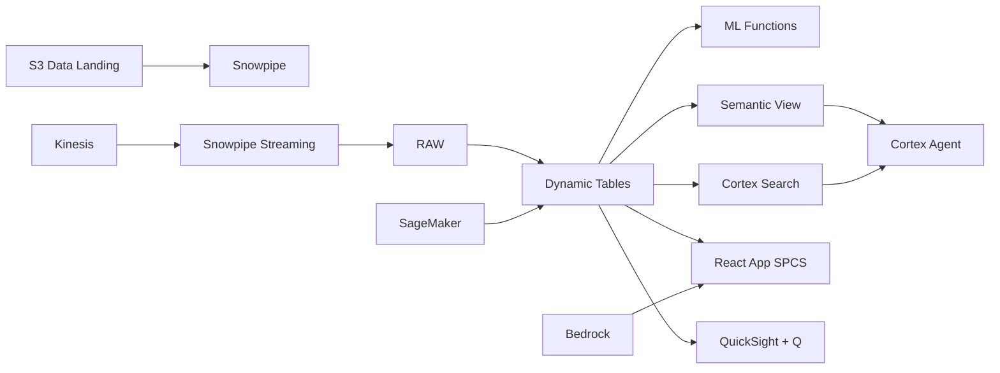

# Nickel Trading & Market Intelligence

Nickel commodity trading intelligence for Indonesia's US$33B nickel sector — ML.FORECAST projects LME nickel prices, Dynamic Tables maintain position books, and Cortex AI synthesizes market research.

## Architecture

An Indonesian nickel producer manages US$4.2 billion in annual sales across physical offtake and LME derivative positions. With 8,500 tonnes net long, volatile LME prices, and Indonesian export policy uncertainty, the Head of Trading needs real-time position visibility and AI-synthesized market intelligence — not end-of-day spreadsheets and PDF broker reports.



## Snowflake Capabilities

| Capability | Implementation |
|-----------|---------------|
| Dynamic Tables | POSITION_BOOK / FORWARD_CURVE / SUPPLY_DEMAND_BALANCE / CONTRACT_EXPOSURE |
| ML Functions | ML.FORECAST |
| Cortex AI | COMPLETE, SUMMARIZE, AI_EXTRACT |
| Cortex Search | 250 documents indexed |
| Cortex Agent | NICKEL_TRADING_AGENT |
| Semantic View | NICKEL_TRADING_ANALYTICS |
| React App (SPCS) | 5 tabs + DemoGuide |


## AWS Services

| Service | Role in Demo |
|---------|-------------|
| Amazon Kinesis | Stream real-time LME price feeds and trade executions |
| Amazon SageMaker | Price prediction models for LME nickel |
| Apache Iceberg (S3) | Open table format for buyer supply-demand data sharing |
| AWS Glue | ETL for trade reconciliation and market data integration |
| Amazon Bedrock (Claude) | Generate market commentary and synthesize research intelligence |
| Amazon QuickSight + Q | Trading desk dashboard with natural language queries |


## Personas

| Persona | Role | Key Questions |
|---------|------|---------------|
| **Ricky Tan** | Head of Nickel Trading | "What's our net nickel position and P&L?" "What's the LME nickel price forecast for next quarter?" |
| **Amelia Tanoto** | Market Research Analyst | "What's the global nickel supply-demand forecast for 2025?" "Show me the correlation between Chinese steel production and nickel prices." |


## Data

| Table | Rows | Description |
|-------|------|-------------|
| TRADES | 8,000 | Physical and LME derivative nickel trades with counterparty and pricing |
| MARKET_PRICES | 300,000 | LME 3-month nickel, cash settlement, and physical premiums globally |
| SUPPLY_DEMAND | 5,000 | Global nickel supply-demand balance by region and end-use sector |
| POSITIONS | 3,000 | Net position by product, delivery month, and counterparty |
| MARKET_RESEARCH | 250 | Broker reports, analyst notes, government policy papers, and industry research |
| BUYER_CONTRACTS | 100 | Long-term offtake agreements with pricing formulas and volume commitments |


## Build Instructions

### Prerequisites
- Snowflake account with ACCOUNTADMIN access
- Cortex AI enabled (ML Functions, Search, Agent)
- Warehouse: NI_TRADING_WH (Medium)
- AWS CLI with access (us-west-2)

### Deployment

```bash
snowsql -f snowflake/00_setup.sql
snowsql -f snowflake/01_marketplace_install.sql
snowsql -f snowflake/02_raw_tables.sql
snowsql -f snowflake/03_staging.sql
snowsql -f snowflake/04_dynamic_tables.sql
snowsql -f snowflake/05_search.sql
snowsql -f snowflake/06_ml_models.sql
snowsql -f snowflake/07_semantic_view.sql
snowsql -f snowflake/08_agent.sql
```

### React App (SPCS)
```bash
cd app && npm ci && npm run build
docker build -t aws-indonesia-mining-nickel-trading-app .
docker push bdiqc8sm-default.registry.snowflakecomputing.com/nickel_trading/app/aws_indonesia_mining_nickel_trading/app:latest
```

### Demo Mode
Open the app URL with `?demo=true` for presenter view.

## Build Modes

### Snowflake Only
Run scripts 00-08 (skip AWS-specific integration). Uses:
- **Snowpipe Streaming SDK** instead of Amazon Kinesis
- **ML.FORECAST** instead of Amazon SageMaker
- **Snowflake-managed Iceberg Tables** instead of Apache Iceberg (S3)
- **Dynamic Tables** instead of AWS Glue
- **Cortex Complete** instead of Amazon Bedrock (Claude)
- **Snowflake Intelligence (Cortex Analyst)** instead of Amazon QuickSight + Q

### Full AWS + Snowflake
Run all scripts including AWS integration. Deploy QuickSight dashboard from `quicksight/`.

## Business Impact

Industry research and Snowflake customer outcomes:
- **Indonesia's nickel exports were valued at US$33B in 2023 — largest globally** — [BPS Indonesia](https://www.bps.go.id/)
- **LME nickel price volatility averaged 32% in 2023 — requiring sophisticated risk management** — [LME](https://www.lme.com/Metals/EV/LME-Nickel)
- **Indonesian export policy changes have moved LME nickel by 10-15% in past episodes** — [Reuters](https://www.reuters.com/)
- **AI-driven commodity trading reduces position management latency by 60-80%** — [McKinsey Commodities](https://www.mckinsey.com/industries/metals-and-mining/our-insights)


## Key Demo Numbers

- **8,500t net long** nickel position across LME and physical
- **Rp 42B MTM** mark-to-market gain on current positions
- **US$4.2B** annual trading revenue
- **300,000 prices** LME and physical market data points
- **250 reports** broker and policy research documents searchable
- **100 contracts** buyer offtake agreements with price formulas


## License

Apache 2.0 — See [LICENSE](LICENSE) for details.

This is a personal demo project and is not an official Snowflake offering. It comes with no support or warranty.